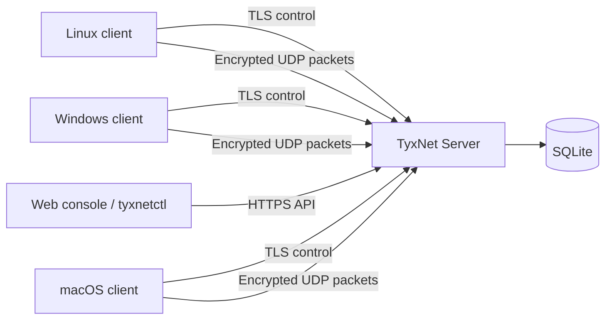

<div align="center">

# TyxNet

**Self-hosted device enrollment, management, and experimental private networking.**

[](https://github.com/fbeser/tyxnet/releases/latest)
[](https://github.com/fbeser/tyxnet/actions/workflows/ci.yml)
[](https://github.com/fbeser/tyxnet/pkgs/container/tyxnet)
[](https://go.dev/)
[](#platform-support)
[](LICENSE)

[Quick Start](#quick-start) · [Downloads](https://github.com/fbeser/tyxnet/releases/latest) · [Documentation](#documentation) · [Security](SECURITY.md) · [Roadmap](docs/roadmap.md)

</div>

TyxNet is an open-source control plane for enrolling and managing devices behind
NAT or CGNAT. Devices initiate outbound connections to a central server, receive
private IPv4 identities, and appear in a role-aware web console.

> [!IMPORTANT]
> Encrypted central UDP forwarding is implemented for experimental virtual-IP
> traffic. TyxNet is still an experimental development release, not a
> production-ready or independently audited VPN replacement.

> [!WARNING]
> The protocol has not undergone an independent security audit. Do not expose a
> plaintext deployment to the public internet. Use TLS or a trusted HTTPS reverse
> proxy and obtain an independent review before production use.

## Quick start

### Raspberry Pi or Linux with Docker

This is the easiest server installation. The Compose file pulls a public
multiarch image; Raspberry Pi does **not** compile the Go project locally.

Requirements: 64-bit Linux, Docker Engine, Docker Compose v2 or legacy Compose
v1.29, and `/dev/net/tun`. Raspberry Pi OS should report `aarch64` from
`uname -m`.

Download the Compose file first:

```bash
mkdir tyxnet && cd tyxnet
curl -fLO https://raw.githubusercontent.com/fbeser/tyxnet/main/docker-compose.yml
```

#### Current Docker Compose v2

```bash
sudo docker compose version
sudo docker compose pull
sudo docker compose up -d
sudo docker compose logs -f tyxnet-server
```

If `docker compose version` fails, install the
[Compose plugin](https://docs.docker.com/compose/install/linux/) or update
[Docker Engine](https://docs.docker.com/engine/install/).

#### Legacy `docker-compose`

```bash
sudo docker-compose --version
sudo docker-compose pull
sudo docker-compose up -d
sudo docker-compose logs -f tyxnet-server
```

Legacy Compose remains available for older Raspberry Pi installations, although
Docker recommends the maintained Compose v2 plugin.

Open the dashboard from another device on the trusted LAN:

```text
http://RASPBERRY_PI_OR_SERVER_IP:8443
```

The first page creates the initial administrator. Docker stores the database in
the persistent `tyxnet-data` volume. Compose already starts the server after a
host reboot through `restart: unless-stopped`, so the dashboard hides **Run at
startup** inside containers; systemd is neither installed nor required there.

Update or remove the container:

```bash
# Update
sudo docker compose pull
sudo docker compose up -d

# Stop without deleting data
sudo docker compose down
```

With legacy Compose, replace `docker compose` with `docker-compose` in these
commands.

Published image:

```text
ghcr.io/fbeser/tyxnet:latest
```

Architectures: `linux/amd64` and `linux/arm64`.

### Public HTTPS with Docker

A public deployment needs a domain whose A/AAAA record points to the server.
Forward TCP `80` and `443`, plus UDP `51830`, from the modem to the Raspberry Pi.
Then run the HTTPS Compose stack:

```bash
mkdir -p tyxnet && cd tyxnet
curl -fLO https://raw.githubusercontent.com/fbeser/tyxnet/main/docker-compose.https.yml
printf 'TYXNET_DOMAIN=vpn.example.com\n' > .env
sudo docker compose -f docker-compose.https.yml pull
sudo docker compose -f docker-compose.https.yml up -d
```

Legacy Compose uses the same commands with `docker-compose`. Caddy obtains and
renews the public certificate automatically. Open `https://vpn.example.com` and
configure every client with that HTTPS URL. Do not expose the server's internal
TCP `8443` listener when using this stack.

Already enrolled clients keep their device identity; only change `server:` to
the new HTTPS URL and restart TyxNet. Windows stores this file at
`C:\ProgramData\TyxNet\client.yaml`; macOS stores it under
`~/Library/Application Support/TyxNet/client.yaml`. No new enrollment token is
required.

### macOS

1. Open the [latest release](https://github.com/fbeser/tyxnet/releases/latest).
2. Download `TyxNet-<version>-macos-universal.dmg`.
3. Drag **TyxNet Client** or **TyxNet Server** into Applications.
4. On first launch, right-click the app and select **Open**.
5. Approve the administrator prompt required for the native tunnel process.

The universal DMG supports Intel and Apple Silicon. Client and Server run as
menu-bar apps; configuration is stored under
`~/Library/Application Support/TyxNet` and logs under `~/Library/Logs/TyxNet`.

The current apps are ad-hoc signed but not Apple-notarized. Gatekeeper may show
an unsigned developer warning. Disable **Run at startup** before deleting the app
to remove its LaunchDaemon and LaunchAgent registrations.

### Windows

1. Open the [latest release](https://github.com/fbeser/tyxnet/releases/latest).
2. Download `TyxNet-<version>-windows-amd64.msi`.
3. Run the installer and approve the UAC prompt.
4. Launch **TyxNet Client** or **TyxNet Server** from the Start menu.

The x64 MSI installs the server, client, tray companions, `tyxnetctl`, and the
verified Wintun 0.14.1 runtime under `Program Files\TyxNet`. Mutable data and logs
are stored under `ProgramData\TyxNet`.

The MSI is not Authenticode-signed, so Windows SmartScreen may warn on first
launch. Windows ARM64 binaries are available as standalone `.exe` files in the
release; an ARM64 MSI is not available yet.

### Native Linux server

Download the binary matching the host architecture from the
[latest release](https://github.com/fbeser/tyxnet/releases/latest):

```bash
# Raspberry Pi 5 / Linux ARM64
curl -fLO https://github.com/fbeser/tyxnet/releases/download/v0.3.0/tyxnet-server-linux-arm64
curl -fLO https://github.com/fbeser/tyxnet/releases/download/v0.3.0/checksums.txt
grep 'tyxnet-server-linux-arm64$' checksums.txt | sha256sum -c -
chmod +x tyxnet-server-linux-arm64

sudo ./tyxnet-server-linux-arm64 install \
  --listen-address 0.0.0.0 \
  --api-port 8443 \
  --tunnel-port 51830 \
  --network 10.90.0.0/24
```

For x64 Linux, replace `arm64` with `amd64`. The install command copies the
binary to `/usr/local/bin/tyxnet-server`, writes `/etc/tyxnet/server.yaml`,
creates `/var/lib/tyxnet`, installs a systemd unit, and starts it.

```bash
sudo systemctl status tyxnet-server
sudo journalctl -u tyxnet-server -f
```

## What works today

| Area | Status |
|---|---|
| First-admin setup and authenticated web console | Working |
| Users, roles, sessions, enrollment tokens, devices, and audit events | Working |
| Ed25519 enrollment and challenge-authenticated control connection | Working |
| Reconnect, heartbeat, device presence, and role-scoped views | Working |
| Network-flow topology and 60-second traffic dashboard | Working |
| Linux TUN, Windows Wintun, and macOS utun adapter creation | Experimental |
| Windows tray and macOS menu-bar companions | Experimental |
| Native Linux systemd installation | Working |
| Multiarch Docker image and Compose deployment | Working |
| Encrypted UDP packet data plane and virtual-IP traffic | Experimental |
| Authenticated remote reconnect, restart, shutdown, and result reporting | Working |
| Signed/notarized desktop distribution | Not complete |
| Mobile clients, P2P, STUN, and hole punching | Planned |

With HTTPS control and UDP `51830` reachable, traffic such as
`ping 10.90.0.1` or `ssh user@10.90.0.4` crosses the central encrypted data
plane. Host firewalls and the destination service must still allow that traffic.

## Features

- Central self-hosted server with SQLite persistence and append-only migrations
- Browser-based server management and client enrollment/status consoles
- Users, RBAC roles, enrollment tokens, sessions, commands, and audit records
- Ed25519 device identity and challenge authentication
- HKDF-SHA256, ChaCha20-Poly1305, directional keys, and replay protection
- Argon2id passwords and one-way hashes for random tokens
- Virtual source-IP validation and central routing policy
- Live network topology, per-flow Mbps, packet totals, and 60-second throughput charts
- Windows Wintun, Linux TUN, and macOS utun platform adapters
- Windows notification-area and macOS menu-bar companions
- Strict enum-based remote command allowlist with no server-provided shell text
- Linux systemd, Docker Compose, Windows MSI, and universal macOS DMG packaging
- Cross-builds and release checksums for Linux, Windows, and macOS

## Architecture



TyxNet uses a central star topology. Clients connect outbound through NAT or
CGNAT; no inbound client port forwarding is required. TyxNet does not use
WireGuard and does not route general internet traffic through the tunnel by
default. See [Architecture](docs/architecture.md) and
[Protocol](docs/protocol.md).

## Platform support

| Platform | Architectures | Server adapter | Client adapter | Desktop UI | Package |
|---|---|---:|---:|---:|---|
| Linux | amd64, arm64 | TUN | TUN | Web | Binary / Docker |
| macOS | Intel, Apple Silicon | `utunN` | `utunN` | Web + menu bar | Universal DMG |
| Windows | amd64, arm64 | Wintun | Wintun | Web + tray | x64 MSI / binaries |
| Android / iOS | Planned | — | — | — | — |

## Server setup

### First administrator

For trusted-LAN installs, open `http://SERVER_IP:8443` and complete the setup
form. To create the administrator from the CLI without placing the password in
process arguments:

```bash
printf '%s\n' 'a-strong-password' | sudo tyxnet-server admin create \
  --config /etc/tyxnet/server.yaml \
  --username admin \
  --password-stdin
```

### Enrollment token

```bash
sudo tyxnet-server token create \
  --config /etc/tyxnet/server.yaml \
  --user admin \
  --expires 24h \
  --max-uses 1
```

The web console can create and revoke enrollment tokens without using the CLI.

## Client setup

### Linux client

Download `tyxnet-client-linux-amd64` or `tyxnet-client-linux-arm64` from the
release, make it executable, then enroll and install it:

```bash
chmod +x tyxnet-client-linux-arm64
sudo ./tyxnet-client-linux-arm64 install \
  --server https://vpn.example.com \
  --token TYX-EXAMPLE \
  --name workshop-pc
```

The command stores the client identity with owner-only permissions and creates a
systemd service.

### macOS client

Install **TyxNet Client.app** from the universal DMG, open the menu-bar icon, and
select **Open Web Console**. Enter the server URL, device name, and enrollment
token. The local UI is available at `http://127.0.0.1:9070`.

macOS packet routing remains experimental and a production Network Extension is
not implemented. See [macOS client notes](docs/macos-client.md).

### Windows client

Install the x64 MSI, launch **TyxNet Client**, and use its tray menu to open the
local enrollment console. The launcher requests administrator access and uses
the bundled Wintun runtime. The local UI is available at
`http://127.0.0.1:9070`.

See [Windows client notes](docs/windows-client.md).

## Web console and roles

The server dashboard provides setup, login, overview counters, device rename and
revoke, persistent virtual-IP assignment, command actions, user and role
management, administrator password resets, token management, command history,
server settings, network-flow telemetry, and audit logs. The flow panel shows
device-to-device direction, current Mbps, packet totals, and a 60-second chart
from successfully routed virtual-IP packets. Resetting a password signs out
every existing session for that user; the new password must contain at least 12
characters. **Remember me** creates a 30-day session only over HTTPS.

| Role | Devices visible to clients | Client controls |
|---|---|---|
| Admin | All devices | Reconnect, restart, shutdown |
| Operator | All devices | Reconnect, restart, shutdown |
| Viewer | All devices | View only |
| Member | Devices owned by that user | View only |

Admins, operators, and viewers can view flow metadata. Members cannot access the
cross-device flow panel. Traffic payloads, ports, and protocol contents are not
stored; live counters remain only in server memory for 60 seconds.

Reconnect, restart, and shutdown commands are delivered over the authenticated
control stream and tracked as queued, delivered, accepted, succeeded, failed, or
expired. Clients accept only fixed allowlisted actions: Windows uses
`shutdown.exe`, Linux uses `systemctl`, and macOS uses `/sbin/shutdown`. The
client service must run with the operating-system privileges required by those
commands. No server-provided text is passed to a shell.

## CLI

```bash
tyxnetctl --server https://vpn.example.com login \
  --username admin --password '...'

export TYXNET_SERVER=https://vpn.example.com
export TYXNET_ACCESS_TOKEN=TYX-...

tyxnetctl devices list
tyxnetctl users list
tyxnetctl tokens list
```

A password supplied on the command line may be visible in the process list. Use
a secure secret source or the API for automation.

## Configuration

Example YAML files are under [`configs/`](configs/). The server validates
addresses, ports, CIDRs, TLS paths, and plaintext-bind opt-in at startup.

Important locations:

| Installation | Configuration | Data / identity | Logs |
|---|---|---|---|
| Docker server | Image default or mounted YAML | `tyxnet-data` volume | `docker compose logs` |
| Native Linux server | `/etc/tyxnet/server.yaml` | `/var/lib/tyxnet` | systemd journal |
| Windows MSI | `ProgramData\TyxNet` | `ProgramData\TyxNet` | `ProgramData\TyxNet\logs` |
| macOS app | `~/Library/Application Support/TyxNet` | Same directory | `~/Library/Logs/TyxNet` |

Private keys and tokens are never written into server configuration YAML.

## Ports

| Port | Protocol | Purpose |
|---:|---|---|
| 443 | TCP/UDP | Public HTTPS through Caddy (HTTPS Compose stack) |
| 8443 | TCP | Direct/LAN dashboard, enrollment, and control APIs |
| 51830 | UDP | Encrypted virtual-IP packet tunnel |
| 9070 | TCP | Local client enrollment and status UI |

Allow only the required ports from intended networks. Never expose TCP 9070 to
the public internet. The default Docker Compose file publishes TCP 8443 to the
LAN for first setup and should be used only on a trusted network until TLS is
configured.

Clients initiate UDP keepalives, so no client-side port forwarding is needed.
The server-side modem/firewall must forward UDP `51830` to the TyxNet server.

## Operations

### Docker

```bash
sudo docker compose ps
sudo docker compose logs -f tyxnet-server
sudo docker compose restart tyxnet-server
sudo docker compose pull && sudo docker compose up -d
```

### Native Linux

```bash
sudo systemctl status tyxnet-server
sudo systemctl restart tyxnet-server
sudo journalctl -u tyxnet-server -f
```

Uninstall removes the native binary, unit, and configuration but intentionally
preserves server data for recovery.

## Build from source

Requirements: Go 1.25 or newer. Desktop tray builds also require the native
Windows or macOS toolchain.

```bash
git clone https://github.com/fbeser/tyxnet.git
cd tyxnet
make build
make test
```

Useful targets:

| Command | Purpose |
|---|---|
| `make build` | Build server, client, trays, and CLI for the host |
| `make test` | Run unit and integration tests |
| `make test-race` | Run the Go race detector |
| `make vet` | Run `go vet` |
| `make lint` | Run `golangci-lint` |
| `make release` | Cross-build release binaries and checksums |
| `make package-macos` | Build the universal DMG on macOS |
| `make package-windows` | Build the x64 MSI with `wixl` |

## Release verification

Every GitHub release includes `checksums.txt`:

```bash
grep 'tyxnet-server-linux-arm64$' checksums.txt | sha256sum -c -
```

Tags matching `v*` create release binaries and publish versioned GHCR images.
The `latest` container tag is also updated for `linux/amd64` and `linux/arm64`.

## Documentation

| Topic | Document |
|---|---|
| Architecture | [docs/architecture.md](docs/architecture.md) |
| Protocol | [docs/protocol.md](docs/protocol.md) |
| Security model | [docs/security-model.md](docs/security-model.md) |
| Server installation | [docs/server-installation.md](docs/server-installation.md) |
| Linux client | [docs/linux-client.md](docs/linux-client.md) |
| macOS client | [docs/macos-client.md](docs/macos-client.md) |
| Windows client | [docs/windows-client.md](docs/windows-client.md) |
| OpenAPI | [docs/openapi.yaml](docs/openapi.yaml) |
| Troubleshooting | [docs/troubleshooting.md](docs/troubleshooting.md) |
| Roadmap | [docs/roadmap.md](docs/roadmap.md) |
| Development | [docs/development.md](docs/development.md) |

## Contributing

Read [CONTRIBUTING.md](CONTRIBUTING.md) and [AGENTS.md](AGENTS.md). Security
issues must be reported privately according to [SECURITY.md](SECURITY.md).

## License

Apache License 2.0. See [LICENSE](LICENSE) and
[THIRD_PARTY_NOTICES.md](THIRD_PARTY_NOTICES.md).
