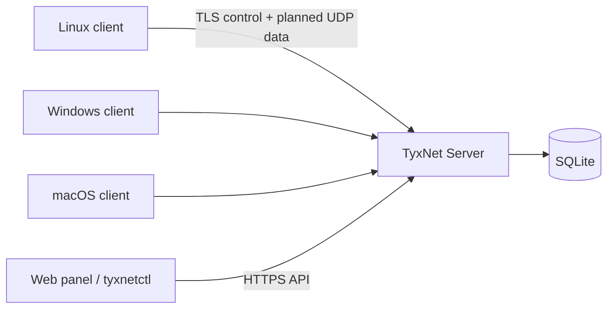

# TyxNet

TyxNet is an open-source, self-hosted virtual network and device management
system. Devices initiate outbound connections to a central server and join the
same private IPv4 network without requiring inbound port forwarding.

> [!WARNING]
> The TyxNet protocol has not undergone an independent security audit. This
> repository provides a functional development foundation; it is not a
> production-ready or proven-secure VPN. Obtain an independent review of the
> threat model, protocol, and implementation before exposing it to the internet.

## What is TyxNet?

The first version uses a central star topology instead of P2P, STUN, or hole
punching. Clients connect outbound through CGNAT, and Layer-3 traffic for the
TyxNet subnet is relayed by the server. TyxNet does not use WireGuard and does
not route general internet traffic through the tunnel by default.

## Features

- SQLite migrations and separate user, device, role, token, and command models
- Ed25519 device enrollment and challenge-authenticated control connections
- X25519, HKDF-SHA256, ChaCha20-Poly1305, and replay-window primitives
- Central routing with virtual source-IP spoofing protection
- Argon2id passwords, hashed random tokens, bearer sessions, RBAC, rate limits,
  and audit events
- Five binaries: `tyxnet-server`, `tyxnet-client`, `tyxnet-tray`,
  `tyxnet-server-tray`, and `tyxnetctl`
- Server management console and role-aware client enrollment/device web console
- Windows system-tray and macOS menu-bar companion with browser and device menus
- Windows Wintun, Linux TUN, and macOS utun server-adapter creation
- Native systemd installation and optional Docker deployment
- Linux, Windows, and macOS cross-build targets
- Strict allowlist-based management commands; no arbitrary remote shell

## Architecture



Control, management, protocol, routing, storage, and platform concerns are kept
separate. See [docs/architecture.md](docs/architecture.md).

## Project status

**Working:** configuration validation, migrations, default LAN-accessible or
optional local-only first-admin web setup,
authenticated management console, user/token/device/command/audit management,
client join, Ed25519 device challenge verification, persistent SSE control
connection, reconnect/backoff, role-scoped client device views, management API,
protocol codec/AEAD/replay tests,
Linux service installation, and the Docker deployment option.

**Experimental:** the server and client create and configure separate native
virtual adapters on Windows, Linux, and macOS. They are not yet connected to the UDP data plane, so their
presence alone does not make virtual-IP traffic work. Commands are safely queued,
but client delivery and result reporting are incomplete.

**Planned:** the complete UDP handshake and data plane, production macOS Network
Extension packaging, Windows Service/MSI packaging, mobile clients, P2P, STUN,
and hole punching.

## Security warning

Go's standard TLS certificate verification is used. A non-loopback server bind
is rejected unless TLS is configured or insecure HTTP is explicitly enabled for
a trusted reverse-proxy network. Only SHA-256 hashes of high-entropy enrollment
and session tokens are stored; passwords use Argon2id. The protocol remains
unaudited. See [SECURITY.md](SECURITY.md).

## Supported platforms

| Platform | Server adapter | Client adapter | Desktop UI |
|---|---:|---:|---:|
| Linux amd64/arm64 | TUN enabled | TUN enabled | Web |
| macOS amd64/arm64 | `utunN` enabled | separate `utunN` enabled | Web + menu bar |
| Windows amd64/arm64 | Wintun enabled | separate Wintun enabled | Web + tray |
| Android/iOS | Planned | Planned | Planned |

Adapter creation is implemented, while packet forwarding through the UDP data
plane remains incomplete; see the platform documents.

## Requirements

- Go 1.24 or newer
- Administrator on Windows, root on macOS, or Linux root/CAP_NET_ADMIN and
  `/dev/net/tun` for native adapter work
- systemd and root for native Linux service installation
- Docker Engine and Compose v2 only if choosing the Docker option

## Quick start

```bash
git clone https://github.com/fbeser/tyxnet.git
cd tyxnet
make build
./bin/tyxnet-server run --config configs/server.yaml
```

The development configuration listens on `0.0.0.0` without TLS for trusted-LAN
use. Open `http://127.0.0.1:8443` locally or
`http://<SERVER-LAN-IP>:8443` remotely; when the database is empty, web setup
creates the first administrator and signs you in.

### Windows one-command start

From PowerShell in the repository root:

```powershell
powershell -ExecutionPolicy Bypass -File .\scripts\start-server.ps1
```

The script requests Administrator access through Windows UAC, builds the server,
downloads Wintun 0.14.1 from the official site when needed, verifies its pinned
SHA-256 checksum, and places the DLL and license beside the executable. It then
creates or reuses the `TyxNet` adapter. Open `http://127.0.0.1:8443` locally or
use the LAN address from another computer. The launcher leaves the server and
tray running in the background and then exits.

TyxNet uses a fixed Wintun adapter GUID, so Windows reuses the same Network
Location Awareness identity instead of creating `TyxNet 2`, `TyxNet 3`, and
later profiles after restarts. Profiles left by older builds are not deleted
automatically.

The Windows launcher also starts `tyxnet-server-tray.exe`. Its system-tray icon
shows whether the local server is available and opens the web console in the
default browser. **Run at startup** creates an elevated Scheduled Task while the
current process already has administrator rights, so later sign-ins do not show
a UAC prompt. **Quit TyxNet** stops both the server and its tray.

LAN access is enabled by default, so another computer can open:

```text
http://<SERVER-LAN-IP>:8443
```

Restrict the server console to this computer when needed:

```powershell
powershell -ExecutionPolicy Bypass -File .\scripts\start-server.ps1 -Local
```

### Headless Raspberry Pi or Linux server

Start the server with explicit trusted-LAN web access:

```bash
sudo ./bin/tyxnet-server run --config configs/server.yaml
```

From another computer, open `http://<RASPBERRY-PI-IP>:8443`. The first-admin
form and the complete dashboard are available there. The default configuration
uses plaintext HTTP and is intended only for a trusted private LAN; use TLS for
access across untrusted networks. Add `--local-web` to restrict it to the
Raspberry Pi itself.

### macOS server with menu bar icon

From Terminal in the repository root:

```bash
bash scripts/start-server-macos.sh
```

The launcher builds the server and `tyxnet-server-tray`, starts the menu bar
icon as the signed-in user, and runs the adapter-enabled server with `sudo`.
Both processes continue in the background after the launcher exits. Clicking
the icon opens the local web console; **Quit TyxNet** stops the core process and
menu-bar companion. Pass a configuration path as the
first argument and optional server flags after it, for example:

```bash
bash scripts/start-server-macos.sh configs/server.yaml --local-web
```

## Is Docker required?

No. **Docker is optional.** Choose either of these server deployment methods:

1. Native Linux installation using the `tyxnet-server install` command and
   systemd.
2. Docker Compose using the supplied image and configuration.

The client does not require Docker. Linux clients use a native binary/service;
native macOS and Windows client service packaging is planned.

## Docker server installation (optional)

`configs/server.docker.yaml` explicitly opts into plaintext HTTP inside the
container. Compose publishes the API only on host `127.0.0.1`; place an HTTPS
reverse proxy on the same host in front of it, or mount certificate files and
enable TLS in the server configuration.

```bash
docker compose up -d --build
docker compose logs -f tyxnet-server
```

Compose grants the container only the `NET_ADMIN` capability and `/dev/net/tun`
device required by the adapter. On Docker Desktop, this adapter exists inside
Docker's Linux VM/container namespace, not as a Windows or macOS host adapter.

Release images can be published as `ghcr.io/fbeser/tyxnet:<tag>`.

## Native Linux server installation

This is the non-Docker deployment path:

```bash
sudo ./bin/tyxnet-server install --listen-address 0.0.0.0 \
  --api-port 8443 --tunnel-port 51830 --network 10.90.0.0/24 \
  --tls-cert /etc/tyxnet/server.crt --tls-key /etc/tyxnet/server.key
```

The command installs the binary, creates `/etc/tyxnet/server.yaml`, prepares the
data and log directories, writes a hardened systemd unit, enables it, and starts
the service. The generated LAN configuration permits plaintext HTTP for trusted
private networks; configure TLS before broader exposure.

## Linux client installation

```bash
sudo ./bin/tyxnet-client install --server https://vpn.example.com:8443 \
  --token TYX-EXAMPLE --name workshop-pc
```

Installation enrolls the device, stores its identity with owner-only permissions,
and starts a systemd service. Virtual-IP traffic remains Experimental until the
UDP data-plane integration is complete.

## macOS client installation

**Experimental.** The client web console and native menu-bar companion are
implemented. Client routing, Network Extension packaging, signing, notarization,
entitlements, and service installation are not complete. See
[docs/macos-client.md](docs/macos-client.md).

For the command-line development build, start both components in the background:

```bash
bash scripts/start-client-macos.sh
```

## Windows client installation

**Experimental.** The Windows start script builds and starts the client plus its
system-tray companion. The server script installs a verified official Wintun
DLL, but there is no finished MSI or Windows Service yet. See
[docs/windows-client.md](docs/windows-client.md).

## Creating the first administrator

For a loopback development server, simply open the web console and complete the
first-time setup. The default configuration also permits first setup from the
trusted LAN. Use `--local-web` or set `allow_remote_setup: false` to disable
remote bootstrap; the CLI remains available:

```bash
printf '%s\n' 'a-strong-password' | sudo tyxnet-server admin create \
  --config /etc/tyxnet/server.yaml --username admin --password-stdin
```

## Creating an enrollment token

Using the local server CLI:

```bash
tyxnet-server token create --config /etc/tyxnet/server.yaml \
  --user admin --expires 24h --max-uses 1
```

Using `tyxnetctl`, first obtain the user ID with `users list`:

```bash
tyxnetctl --server https://vpn.example.com:8443 --token "$TYXNET_ACCESS_TOKEN" \
  tokens create --user-id usr_example --expires 24h --max-uses 1
```

## Adding a device

```bash
tyxnet-client join --server https://vpn.example.com:8443 \
  --token TYX-EXAMPLE --name workshop-pc --state-dir ./client-state
tyxnet-client run --config configs/client.yaml
```

The private Ed25519 key is generated and retained on the client. Only the public
key is sent to the server.

## Accessing devices by virtual IP

The target experience is:

```bash
ssh user@10.90.0.4
```

This is currently **Experimental and not yet functional end-to-end** because the
UDP data plane is incomplete.

## Web panel

The server console at `/` includes first-time setup, login, overview counters,
device rename/revoke, persistent virtual-IP assignment, safe command actions,
user and role management, enrollment token creation/revocation, configurable
device ping intervals, command history, and audit logs. It uses the same
`/api/v1` endpoints as `tyxnetctl` and is embedded in the Go binary.

Administrators can make the same changes through the API. Static addresses must
be unused client addresses inside the configured TyxNet network. Ping intervals
are expressed in seconds and must be between 5 and 3600:

```bash
curl -X PATCH https://vpn.example.com:8443/api/v1/devices/dev_example \
  -H "Authorization: Bearer $TYXNET_ACCESS_TOKEN" \
  -H "Content-Type: application/json" \
  -d '{"VirtualIP":"10.90.0.42"}'

curl -X PATCH https://vpn.example.com:8443/api/v1/server/settings \
  -H "Authorization: Bearer $TYXNET_ACCESS_TOKEN" \
  -H "Content-Type: application/json" \
  -d '{"ping_interval_seconds":60}'

curl -X PATCH https://vpn.example.com:8443/api/v1/server/startup \
  -H "Authorization: Bearer $TYXNET_ACCESS_TOKEN" \
  -H "Content-Type: application/json" \
  -d '{"enabled":true}'
```

The client console can perform first enrollment as well as show connection,
device, virtual-IP, adapter, and role-permitted network-device status. Start it on Windows
with:

```powershell
powershell -ExecutionPolicy Bypass -File .\scripts\start-client.ps1
```

The script requests Administrator access, installs the verified Wintun DLL when
needed, and creates a stable server-specific adapter such as `TyxC-a1b2c3d4`.
Server and client adapters remain separate even on the same computer. Different
server URLs derive different client adapter identities. Set
`tunnel_enabled: false` in the client configuration for control-plane-only use.

Both server and client web consoles expose the same administrator-only **Run at
startup** checkbox as their tray menus. Windows uses an elevated Scheduled Task,
Linux uses systemd plus desktop autostart for the companion, and macOS uses a
LaunchDaemon plus LaunchAgent. Clearing the checkbox removes those registrations
without stopping the currently running process.

Open `http://<CLIENT-LAN-IP>:9070`, enter the server URL, device name, and
enrollment token, then select **Connect device**. LAN access is enabled by
default. Add `-Local` to the PowerShell command to expose it only at
`http://127.0.0.1:9070`. On Linux/macOS, the equivalent local-only option is
`tyxnet-client run --config ./client-state/client.yaml --local-web`. A missing
client configuration is created after the web enrollment form succeeds.

After enrollment, sign in to the client console with a TyxNet server account.
The server applies these permissions:

| Role | Devices visible in clients | Client controls |
|---|---|---|
| Admin | All devices | Reconnect, restart, shutdown |
| Operator | All devices | Reconnect, restart, shutdown |
| Viewer | All devices | View only |
| Member | Devices owned by that user | View only |

The Windows system-tray or macOS menu-bar menu shows the cached permitted device
list after web sign-in. It includes **Open Web Console** and, for admin/operator,
the allowed device actions. **Quit TyxNet** stops the client and closes the tray.
Commands are currently queued but are not yet delivered end-to-end.

## CLI usage

```bash
tyxnetctl --server https://vpn.example.com:8443 login \
  --username admin --password '...'
export TYXNET_SERVER=https://vpn.example.com:8443
export TYXNET_ACCESS_TOKEN=TYX-...
tyxnetctl devices list
tyxnetctl users list
tyxnetctl tokens list
```

Copy the returned `access_token` into the environment variable. A password passed
on the command line may be visible in the process list; avoid that mode for
automation and use a secure secret source with the API instead.

## Configuration

Examples are under `configs/`. The server validates addresses, ports, CIDR, TLS,
and plaintext-bind opt-in at startup. Server and client web interfaces bind to
the LAN by default and accept `--local-web` for loopback-only operation. Private
keys and tokens are never written to YAML.

## Ports

- TCP 8443: dashboard, management, enrollment, and control APIs
- UDP 51830: reserved for the Experimental data tunnel
- TCP 9070: client enrollment/status UI; LAN by default, localhost-only with
  `--local-web`

## Firewall configuration

Allow TCP 8443 and UDP 51830 only from the intended networks. If LAN client UI
access is enabled, allow TCP 9070 only from the private subnet and never expose
it to the internet. TyxNet does not require forwarding all internet traffic
through the server.

## systemd management

`tyxnet-server start|stop|restart|status|logs` and the corresponding client
commands invoke fixed `systemctl` or `journalctl` arguments. Uninstall preserves
the data directory intentionally.

## Logs

The server writes structured JSON to stdout. `tyxnet-server logs` follows the
systemd journal. Passwords, tokens, private keys, session keys, and plaintext
tunneled packets must never be logged.

## Development environment

See [docs/development.md](docs/development.md). The basic loop is:

```bash
make fmt
make test
make vet
```

## Build

`make build` creates the four host binaries in `bin/`. `make web` confirms that
the current UI is compiled directly into Go binaries and needs no separate asset
pipeline.

## Test

Use `make test`, `make test-race`, and `make vet`. CI also runs golangci-lint,
Linux, Windows, and macOS cross-builds, a Docker build, and `govulncheck`.

## Release

`make release` creates core Linux/Windows/macOS artifacts, both Windows tray
binaries, and `checksums.txt`. The Cocoa-based macOS trays must be built natively as
part of the future signed `.app` packaging flow. A `v*` tag creates a GitHub
Release and GHCR image.

## Troubleshooting

Check identity file ownership, the server certificate hostname, clock
synchronization, and service logs. See [docs/troubleshooting.md](docs/troubleshooting.md).

## Roadmap

The phased plan is in [docs/roadmap.md](docs/roadmap.md). macOS native networking,
mobile clients, QR enrollment, and P2P remain explicitly Planned.

## Contributing

Follow [CONTRIBUTING.md](CONTRIBUTING.md) and [AGENTS.md](AGENTS.md).

## License

Apache License 2.0. See [LICENSE](LICENSE) and
[THIRD_PARTY_NOTICES.md](THIRD_PARTY_NOTICES.md).
