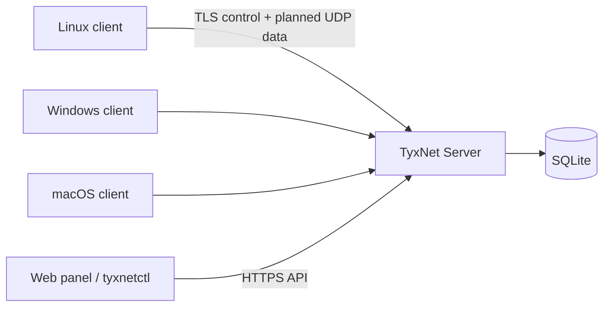

# TyxNet

TyxNet is an open-source, self-hosted virtual network and device management
system. Devices initiate outbound connections to a central server and join the
same private IPv4 network without requiring inbound port forwarding.

> [!WARNING]
> The TyxNet protocol has not undergone an independent security audit. This
> repository provides a functional development foundation; it is not a
> production-ready or proven-secure VPN. Obtain an independent review of the
> threat model, protocol, and implementation before exposing it to the internet.

## What is TyxNet?

The first version uses a central star topology instead of P2P, STUN, or hole
punching. Clients connect outbound through CGNAT, and Layer-3 traffic for the
TyxNet subnet is relayed by the server. TyxNet does not use WireGuard and does
not route general internet traffic through the tunnel by default.

## Features

- SQLite migrations and separate user, device, role, token, and command models
- Ed25519 device enrollment and challenge-authenticated control connections
- X25519, HKDF-SHA256, ChaCha20-Poly1305, and replay-window primitives
- Central routing with virtual source-IP spoofing protection
- Argon2id passwords, hashed random tokens, bearer sessions, RBAC, rate limits,
  and audit events
- Three binaries: `tyxnet-server`, `tyxnet-client`, and `tyxnetctl`
- Minimal server dashboard and a client status page bound to `127.0.0.1:9070`
- Linux TUN foundation, systemd installation, and optional Docker deployment
- Linux, Windows, and macOS cross-build targets
- Strict allowlist-based management commands; no arbitrary remote shell

## Architecture



Control, management, protocol, routing, storage, and platform concerns are kept
separate. See [docs/architecture.md](docs/architecture.md).

## Project status

**Working:** configuration validation, migrations, admin and enrollment token
creation, client join, Ed25519 device challenge verification, persistent SSE
control connection, reconnect/backoff, management API, `devices list`, minimal
web pages, protocol codec/AEAD/replay tests, Linux service installation, and the
Docker deployment option.

**Experimental:** the Linux `/dev/net/tun` adapter can be opened but is not yet
connected to the UDP data plane. Commands are safely queued, but client delivery
and result reporting are incomplete.

**Planned:** the complete UDP handshake and data plane, macOS Network Extension
or utun integration, Windows Wintun/service/installer, full management pages,
mobile clients, P2P, STUN, and hole punching.

## Security warning

Go's standard TLS certificate verification is used. A non-loopback server bind
is rejected unless TLS is configured or insecure HTTP is explicitly enabled for
a trusted reverse-proxy network. Only SHA-256 hashes of high-entropy enrollment
and session tokens are stored; passwords use Argon2id. The protocol remains
unaudited. See [SECURITY.md](SECURITY.md).

## Supported platforms

| Platform | Server | Client | Virtual adapter |
|---|---:|---:|---:|
| Linux amd64/arm64 | Experimental | Experimental | Basic TUN implementation |
| macOS amd64/arm64 | Cross-build | Planned client | Explicitly not implemented |
| Windows amd64 | Cross-build | Planned client | Explicitly not implemented |
| Android/iOS | Planned | Planned | Planned |

The macOS command-line client can be cross-compiled, but it cannot yet create a
working virtual adapter. This limitation is reported as `not implemented`; see
[docs/macos-client.md](docs/macos-client.md).

## Requirements

- Go 1.24 or newer
- Linux root/CAP_NET_ADMIN and `/dev/net/tun` for TUN work
- systemd and root for native Linux service installation
- Docker Engine and Compose v2 only if choosing the Docker option

## Quick start

```bash
git clone https://github.com/fbeser/tyxnet.git
cd tyxnet
make build
printf '%s\n' 'at-least-12-characters' | ./bin/tyxnet-server admin create \
  --config configs/server.yaml --username admin --password-stdin
./bin/tyxnet-server run --config configs/server.yaml
```

The development configuration disables TLS and therefore listens only on
`127.0.0.1`.

## Is Docker required?

No. **Docker is optional.** Choose either of these server deployment methods:

1. Native Linux installation using the `tyxnet-server install` command and
   systemd.
2. Docker Compose using the supplied image and configuration.

The client does not require Docker. Linux clients use a native binary/service;
native macOS and Windows service packaging is planned.

## Docker server installation (optional)

`configs/server.docker.yaml` explicitly opts into plaintext HTTP inside the
container. Compose publishes the API only on host `127.0.0.1`; place an HTTPS
reverse proxy on the same host in front of it, or mount certificate files and
enable TLS in the server configuration.

```bash
docker compose up -d --build
docker compose logs -f tyxnet-server
```

Release images can be published as `ghcr.io/fbeser/tyxnet:<tag>`.

## Native Linux server installation

This is the non-Docker deployment path:

```bash
sudo ./bin/tyxnet-server install --listen-address 0.0.0.0 \
  --api-port 8443 --tunnel-port 51830 --network 10.90.0.0/24 \
  --tls-cert /etc/tyxnet/server.crt --tls-key /etc/tyxnet/server.key
```

The command installs the binary, creates `/etc/tyxnet/server.yaml`, prepares the
data and log directories, writes a hardened systemd unit, enables it, and starts
the service. Non-loopback listening without TLS is rejected.

## Linux client installation

```bash
sudo ./bin/tyxnet-client install --server https://vpn.example.com:8443 \
  --token TYX-EXAMPLE --name workshop-pc
```

Installation enrolls the device, stores its identity with owner-only permissions,
and starts a systemd service. Virtual-IP traffic remains Experimental until the
UDP data-plane integration is complete.

## macOS client installation

**Planned.** Darwin amd64 and arm64 command-line artifacts are produced by the
release pipeline. A LaunchDaemon packaging scaffold is included, but a working
utun/Network Extension adapter, signed `.pkg`, notarization, entitlements, and
service installation are not complete. See [docs/macos-client.md](docs/macos-client.md).

## Windows client installation

**Planned.** Cross-build and WiX scaffolding are present, but there is no working
MSI, Windows Service, or bundled Wintun driver. See
[docs/windows-client.md](docs/windows-client.md).

## Creating the first administrator

```bash
printf '%s\n' 'a-strong-password' | sudo tyxnet-server admin create \
  --config /etc/tyxnet/server.yaml --username admin --password-stdin
```

## Creating an enrollment token

Using the local server CLI:

```bash
tyxnet-server token create --config /etc/tyxnet/server.yaml \
  --user admin --expires 24h --max-uses 1
```

Using `tyxnetctl`, first obtain the user ID with `users list`:

```bash
tyxnetctl --server https://vpn.example.com:8443 --token "$TYXNET_ACCESS_TOKEN" \
  tokens create --user-id usr_example --expires 24h --max-uses 1
```

## Adding a device

```bash
tyxnet-client join --server https://vpn.example.com:8443 \
  --token TYX-EXAMPLE --name workshop-pc --state-dir ./client-state
tyxnet-client run --config configs/client.yaml
```

The private Ed25519 key is generated and retained on the client. Only the public
key is sent to the server.

## Accessing devices by virtual IP

The target experience is:

```bash
ssh user@10.90.0.4
```

This is currently **Experimental and not yet functional end-to-end** because the
UDP data plane is incomplete.

## Web panel

The server dashboard at `/` displays basic counters. The client status page is
available only at `http://127.0.0.1:9070`. Full device, user, token, command, and
audit management pages are Planned.

## CLI usage

```bash
tyxnetctl --server https://vpn.example.com:8443 login \
  --username admin --password '...'
export TYXNET_SERVER=https://vpn.example.com:8443
export TYXNET_ACCESS_TOKEN=TYX-...
tyxnetctl devices list
tyxnetctl users list
tyxnetctl tokens list
```

Copy the returned `access_token` into the environment variable. A password passed
on the command line may be visible in the process list; avoid that mode for
automation and use a secure secret source with the API instead.

## Configuration

Examples are under `configs/`. The server validates addresses, ports, CIDR, TLS,
and public plaintext binds at startup. The client validates that its local UI
binds to `127.0.0.1`. Private keys and tokens are never written to YAML.

## Ports

- TCP 8443: dashboard, management, enrollment, and control APIs
- UDP 51830: reserved for the Experimental data tunnel
- TCP 9070: client status page on localhost only

## Firewall configuration

Allow TCP 8443 and UDP 51830 only from the intended networks. Never expose 9070
on an external interface. TyxNet does not require forwarding all internet traffic
through the server.

## systemd management

`tyxnet-server start|stop|restart|status|logs` and the corresponding client
commands invoke fixed `systemctl` or `journalctl` arguments. Uninstall preserves
the data directory intentionally.

## Logs

The server writes structured JSON to stdout. `tyxnet-server logs` follows the
systemd journal. Passwords, tokens, private keys, session keys, and plaintext
tunneled packets must never be logged.

## Development environment

See [docs/development.md](docs/development.md). The basic loop is:

```bash
make fmt
make test
make vet
```

## Build

`make build` creates the three host binaries in `bin/`. `make web` confirms that
the current UI is compiled directly into Go binaries and needs no separate asset
pipeline.

## Test

Use `make test`, `make test-race`, and `make vet`. CI also runs golangci-lint,
Linux, Windows, and macOS cross-builds, a Docker build, and `govulncheck`.

## Release

`make release` creates Linux amd64/arm64, Windows amd64, and macOS amd64/arm64
artifacts plus `checksums.txt`. A `v*` tag creates a GitHub Release and GHCR image.

## Troubleshooting

Check identity file ownership, the server certificate hostname, clock
synchronization, and service logs. See [docs/troubleshooting.md](docs/troubleshooting.md).

## Roadmap

The phased plan is in [docs/roadmap.md](docs/roadmap.md). macOS native networking,
mobile clients, QR enrollment, and P2P remain explicitly Planned.

## Contributing

Follow [CONTRIBUTING.md](CONTRIBUTING.md) and [AGENTS.md](AGENTS.md).

## License

Apache License 2.0. See [LICENSE](LICENSE) and
[THIRD_PARTY_NOTICES.md](THIRD_PARTY_NOTICES.md).
