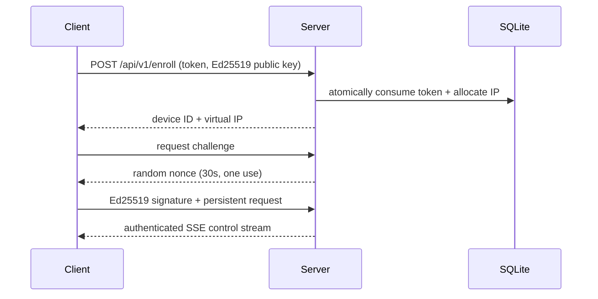

# Architecture

TyxNet v1 is a central star. Management clients use HTTPS; enrolled devices use
a logically separate challenge-authenticated persistent control endpoint. The
data plane transports only IPv4 packets read from TUN over encrypted UDP.

The UDP data plane transports IPv4 packets between native adapters through the
central server. `routing.Router` enforces that an IPv4 source equals the peer's
assigned address and drops unknown targets.
Successfully routed packets feed a payload-blind observer that retains source
and destination virtual IPs, byte counts, and packet counts in one-second memory
buckets for 60 seconds. The management API derives five-second Mbps rates and a
60-second time series from those buckets. Rejected packets are never counted.
`tunnel.Memory` permits rootless integration tests. Server and client adapters
use Linux `/dev/net/tun`, Windows Wintun, or kernel-assigned macOS `utunN`
devices. A client derives a stable adapter identity from its server URL, keeping
it separate from the server adapter and from clients attached to other servers.
These adapters are connected to short-lived encrypted UDP sessions established
through the authenticated HTTPS control stream. Future Android `VpnService` and
macOS/iOS Network Extension clients can implement the same TUN and protocol
boundaries without importing server internals. The
current Darwin command-line client uses a development utun integration; a
production Network Extension remains incomplete.

The server management console is a no-build HTML/CSS/JavaScript application
embedded in the Go binary. It includes a device topology, directional flow map,
and SVG throughput chart backed by the same bearer-authenticated `/api/v1`
surface as `tyxnetctl`. The panel reports live traffic only after the UDP
listener is ready. First-user web setup is available on the LAN by default and
can be restricted to loopback with
`--local-web`.

The same authenticated SSE control connection delivers short-lived allowlisted
commands. SQLite owns the delivery state machine, clients cross an explicit
`accepted` boundary before executing a fixed platform action, and a separate
fresh-challenge Ed25519 proof authenticates each result. This keeps arbitrary
command text out of both the wire format and operating-system execution path.

The client embeds a separate no-build web console. An unconfigured client waits
for enrollment details submitted to its local setup API, stores its identity and
non-secret configuration, then starts the authenticated control connection. Its
management view proxies only an allowlisted set of server endpoints and sends
the user's bearer session to the server, where normal RBAC remains authoritative.
Members receive only devices owned by their user; higher view roles receive all
devices.

`tyxnet-tray` is a separate desktop companion. It reads a loopback-only client
snapshot and command surface, opens the default browser, and renders permitted
devices in the Windows notification area or macOS menu bar. Closing it does not
stop `tyxnet-client`.

`tyxnet-server-tray` is the corresponding Windows notification-area and macOS
menu-bar companion for the server. It checks the loopback health endpoint and
opens the embedded server console. Its authenticated loopback control channel
can configure platform startup and gracefully stop `tyxnet-server`.

Availability is single-node SQLite in this milestone. HA, relay scaling, subnet
routers and exit nodes are explicitly outside v1.
