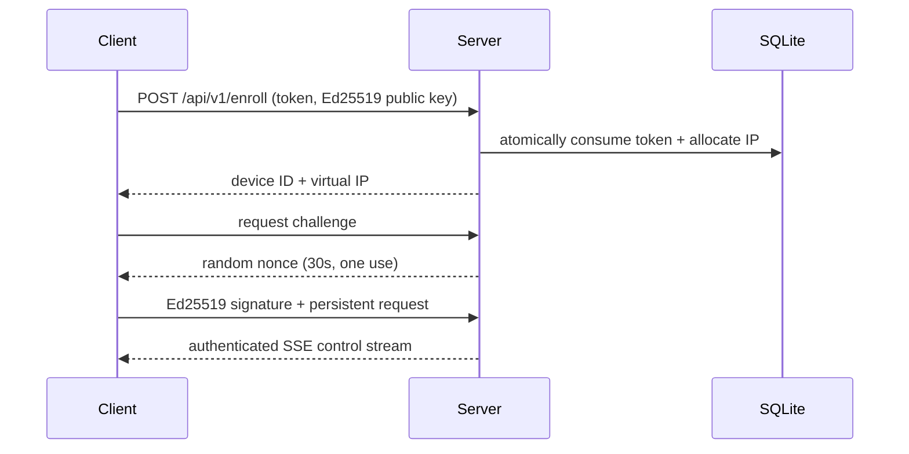

# Architecture

TyxNet v1 is a central star. Management clients use HTTPS; enrolled devices use
a logically separate challenge-authenticated persistent control endpoint. The
planned data plane transports only IPv4 packets read from TUN over UDP.

The UDP data-plane integration is not complete. `routing.Router` already enforces
that an IPv4 source equals the peer's assigned address and drops unknown targets.
`tunnel.Memory` permits rootless integration tests; Linux TUN opens `/dev/net/tun`.
Future Android `VpnService` and macOS/iOS Network Extension clients can implement
the same TUN and protocol boundaries without importing server internals. The
current Darwin package is an explicit, non-functional integration boundary.

Availability is single-node SQLite in this milestone. HA, relay scaling, subnet
routers and exit nodes are explicitly outside v1.
